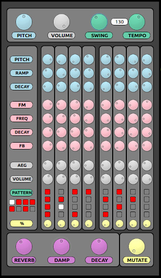

## "MEGA_FM"

### A C++ / Synthesis Toolkit / Qt5 FM synthesizer + sequencer

#### Features:
- Tone generator:
  - 2 sine wave oscillators
  - Osc 1 is heard, osc 2 modulates the phase of osc 1
- Sequencer:
  - 16 steps
  - Parameters for steps 1 and 9, 2 and 10, etc. are the same, so in effect you have an eight step pattern with some added variety through the 16 trig switches
- Reverb:
  - Mono reverb, uses the STK Freeverb class. Sounds really nice

See it in action on YouTube: [Example 1](https://youtu.be/nPyFqWjyMAo ) [Example 2](https://youtu.be/j0YUTtWCITk)

#### Controls:

Each of the 8 steps has:
- **Pitch** sets the base pitch for the oscillators
- **Ramp** sets the pitch envelope amount. The envelope is a simple decay envelope, always starting at max value
- **Decay (blue)** sets the pitch envelope decay time
- **FM** sets the amount of modulation from oscillator 2 to oscillator 1
- **Freq** sets the frequency of oscillator 2 relative to the base pitch
- **Decay (pink)** sets the decay of the modulation amount so that short decay only allows for modulation on the beginning of the sound
- **FB** sets the amount by which oscillator 2 modulates itself. High amounts of FB produce noise, low amounts are still a bit quirky
- **AEG** sets the amplitude envelope decay for determining the length of the sound
- **Volume** sets the volume of the step
- **Steps** two step buttons controlling whether the sound will trigger by default or not
- **%** which introduces random variation to the step trigges. % at zero means the sound will trig if and only if the step button is active. % at full means the step will trig with a probability of 0.5 regardless of the step button status

Additionally, there are **master controls** for pitch, FM amount (not implemented) and volume. Also controls for tempo and reverb parameters which do what you would expect. Tempo can be set in the range [60, 180] bpm. The **Mutate** control is not yet implemented to do anything

### TODO:
- Add STK as submodule?
- Implement **Mutate** so that it will change parameters by a random amount each time a step is passed. There should be a way to "lock" steps that are not wanted to mutate
- Implement sound saving and loading. It should work like this: Right click on the dial strip brings up a context menu with the options to save and load. Choose save -> prompt for sound name, save sound. Choose load -> display saved sounds, select one, the step is set to those parameters. Perhaps also have categories of sounds such as "bass drum", "perc", "snare" etc
